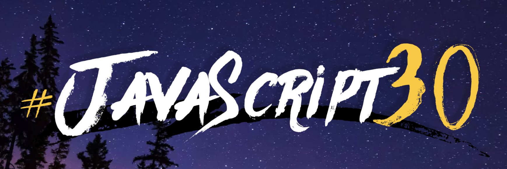

  

<h2 align="center">💪🏻 JavaScript 30</h2>

30 Day Vanilla JS Coding Challenge

    <a href="https://javascript30.com/">🔗 JavaScript 30 Coding Challenge 바로가기</a>

 

## 💪🏻 30일 동안 바닐라 자바스크립트 챌린지를 진행하기
프로그래밍 언어와 친숙해지는 데는 여러 가지 방법이 있지만,     
해당 언어를 이용해서 무언가를 만들어보는 게 가장 빠르다고 한다.

 

## 📆 2023.02.08 ~ 2023.03.11
위 기간동안 1일 1페이지를 목표로 합니다.

Day | Date | Title
:---:|:---:|:-----|
Day1 | 2023.02.08 | [JavaScript Drum Kit]()
Day2 | 2023.02.09 | CSS + JS Clock
Day3 | 2023.02.10 | Playing with CSS Variables and JS